<div align="center">

<picture>
  <source media="(prefers-color-scheme: dark)" srcset="assets/logo-white.svg">
  <source media="(prefers-color-scheme: light)" srcset="assets/logo.svg">
  
</picture>

**Plugins and themes for [degoog](https://github.com/fccview/degoog) search but with a \tʁɑ̃.kil\ twist.**

Built for [degoog](https://github.com/fccview/degoog) · Inspired by [fccview-degoog-extensions](https://github.com/fccview/fccview-degoog-extensions)

</div>

---

## Theme - Trankil

A calm \tʁɑ̃.kil\ theme designed for an easy browsing experience.

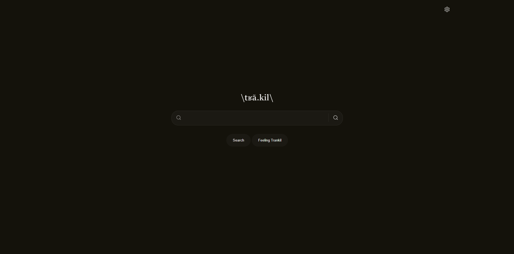
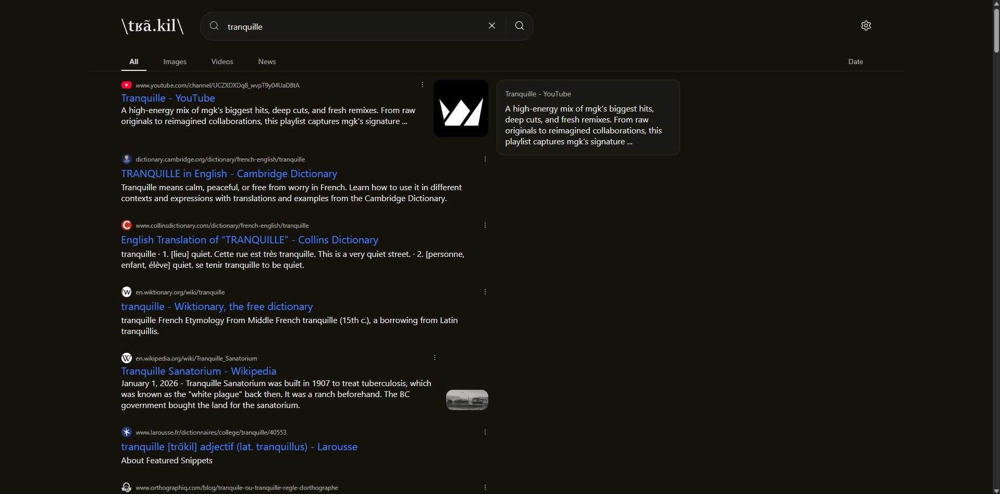

---

## Installation

Add this repository to your degoog instance from the **Settings → Stores** page, or by adding it directly to your `data/repos.json`:

```json
{
  "url": "https://github.com/Arkmind/trankil"
}
```

Then browse to **Settings → Plugins** or **Settings → Themes** to enable what you want.

---

## Plugins

### [Calculator](plugins/calculator)

A simple calculator plugin that evaluates basic math expressions directly from the search bar.

<details>
<summary>Screenshot</summary>

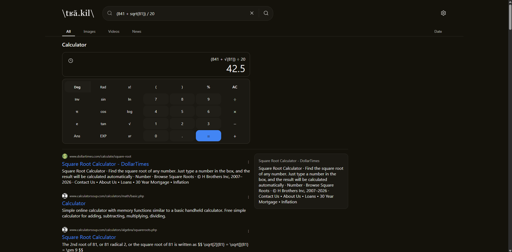

</details>

---

### [Currency](plugins/currency)

Live currency conversion rates - type e.g. `1000 yen to usd` to convert on the fly.

<details>
<summary>Screenshot</summary>

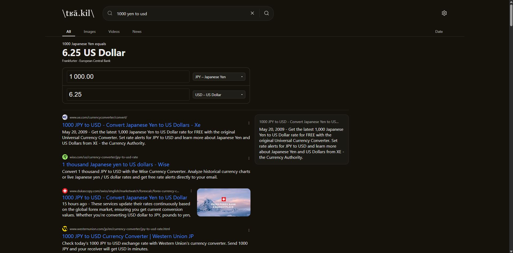

</details>

---

### [Dictionary](plugins/dictionary)

Word definitions, phonetics and part-of-speech - type e.g. `definition tranquille`.

<details>
<summary>Screenshot</summary>

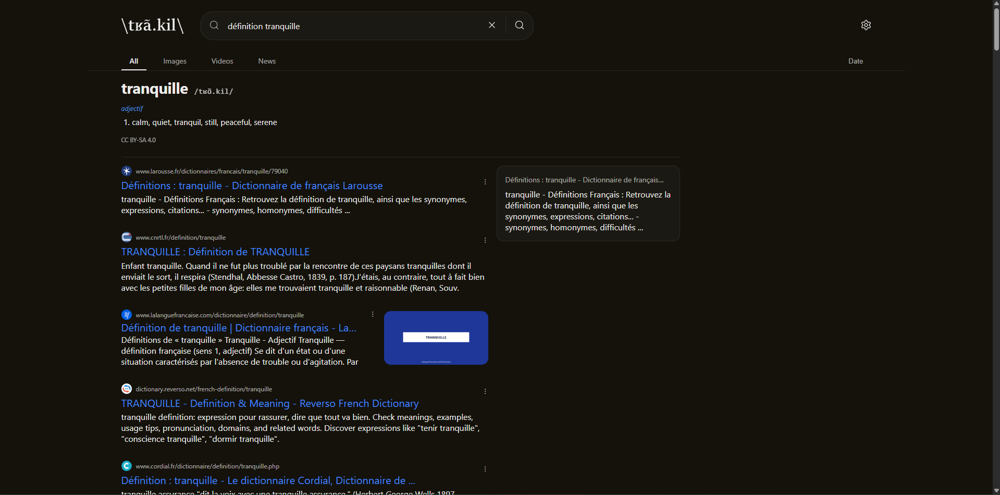

</details>

---

### [Lyrics](plugins/lyrics)

Song lyrics fetched inline - type e.g. `kana tranquille lyrics`.

<details>
<summary>Screenshots</summary>

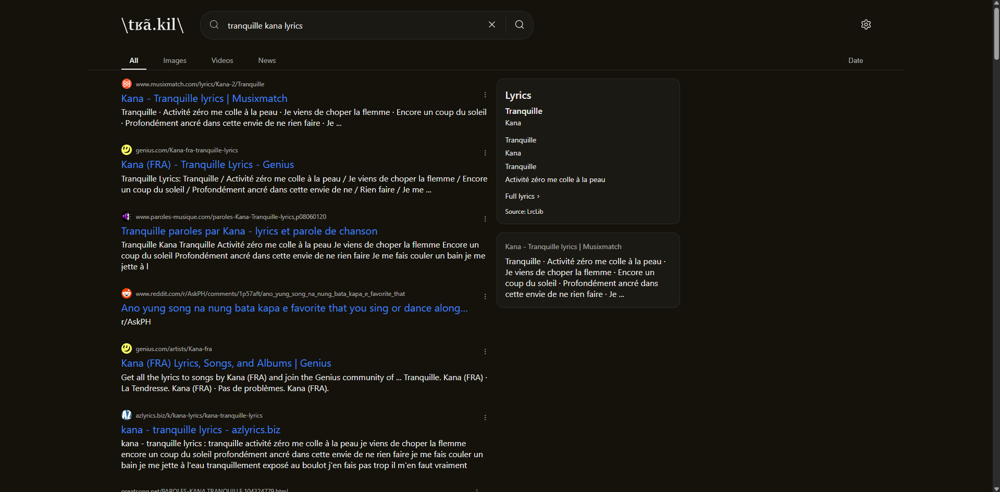
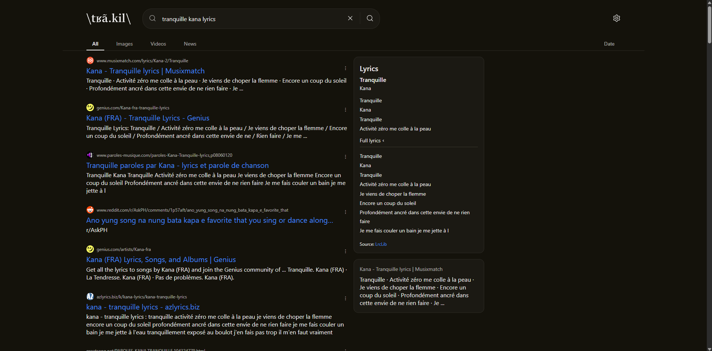

</details>

---

### [Stopwatch](plugins/stopwatch)

Built-in stopwatch and countdown timer - type e.g. `timer 5mn`.

<details>
<summary>Screenshot</summary>

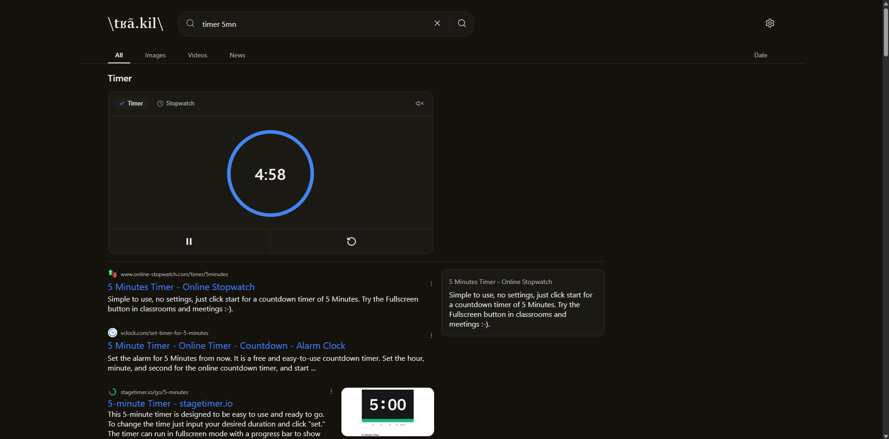

</details>

---

### [TMDB](plugins/tmdb)

Movie and TV show information powered by [The Movie Database](https://www.themoviedb.org/).

<details>
<summary>Screenshots</summary>

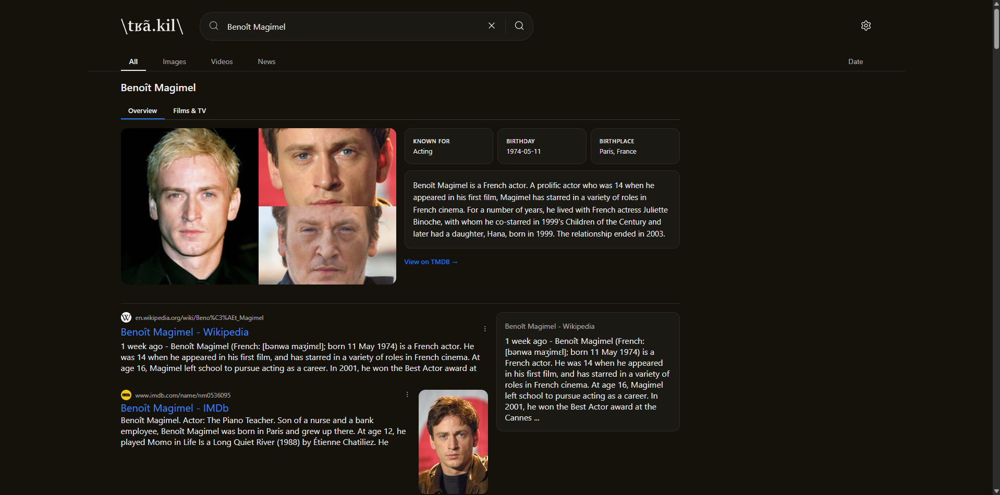
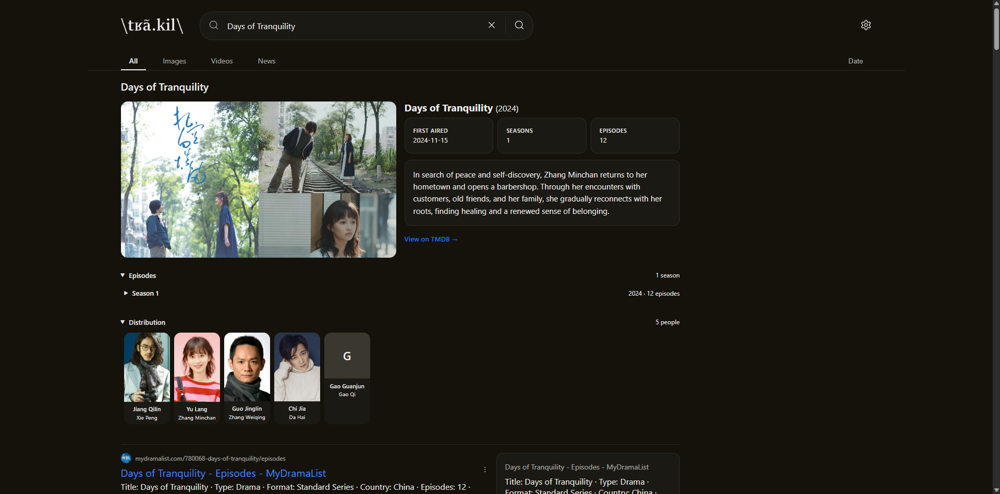
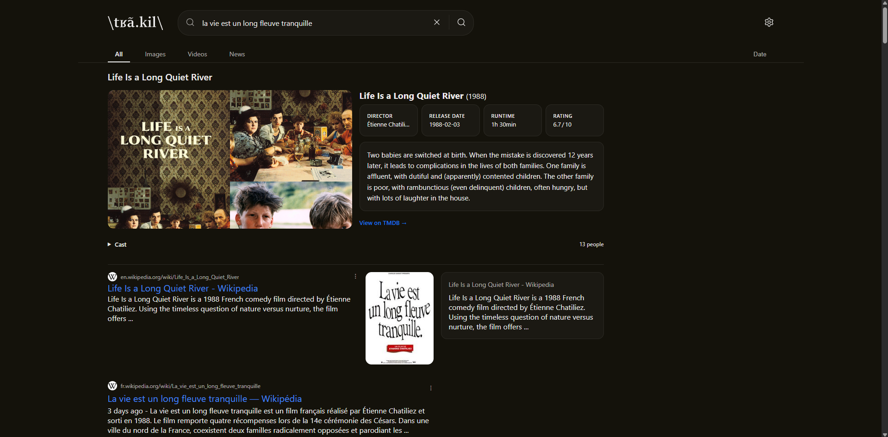

</details>

---

### [Wikipedia](plugins/wikipedia)

Shows a [Wikipedia](https://www.wikipedia.org/) summary card when the search query exactly matches an article title.

<details>
<summary>Screenshots</summary>

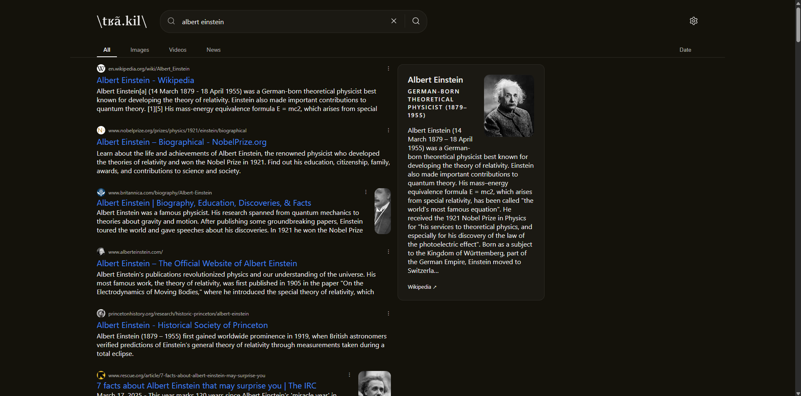

</details>

---

## Roadmap

- **Responsive** for [trankil](themes/trankil) theme.
- More **plugins**
  - **code-snippet**
    *Code search with syntax highlighting, copy button and execution.*
  - **company**
    *Company informations, latest news, founders, creation date, etc.*
  - **equation-solver**
    *Solve math equations and plot graphs.*
  - **function-grapher**
    *Graph functions directly from the search bar.*
  - **maps**
    *Map search and directions using OpenStreetMap (already exists, but improve it with more infos https://github.com/lazerleif/degoog-maps.git).*
  - **music**
    *Search for songs, artists and albums with poster previews and links to listening platforms.*
  - **periodic-table**
    *Interactive periodic table with element information.*
  - **recipes**
    *Recipe search with ingredients, instructions and nutritional information.*
  - **spell-correction**
    *Suggest correct spellings for search queries with typos.*
  - **stocks**
    *Stock prices, charts and company information, including cryptocurrency.*
  - **time**
    *Current time and timezone information for any location in the world.*
  - **translator**
    *Language translation powered by a free API or local whisper/LLM.*
  - **unit-converter**
    *Convert between various units of measurement (length, weight, temperature, etc.).*
  - **weather**
    *Current weather and forecast for any location, using a free API.*

---

## Thanks

- [fccview](https://github.com/fccview) for building [degoog](https://github.com/fccview/degoog) and the [fccview-degoog-extensions](https://github.com/fccview/fccview-degoog-extensions) ecosystem that makes this possible.

---

## License

This project is released under the [MIT License](LICENSE).
